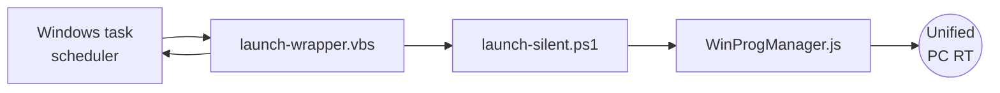

# Unified Windows Program Manager
A small piece of software that runs as a `Windows task (task scheduler)` that executes an OpenPipe script (`WinProgManager.js`) that subscribe to some variables in the locally running `WinCC Unified PC RT` application. 

## Installation Steps
1. **Download** the file package `Unified-WindowsProgramManager.zip` from this repository.
2. **Unzip** the files to any location on the WinCC Unified PC RT station.
3. **Run** the `Install_Task_RunAsAdmin.bat` file as **administrator**.

## Uninstallation step
1. **Run** the `Uninstall_Task_RunAsAdmin.bat` file as **administrator**.

## Steps in TIA Portal
1. **Download** the file `Unified-WinProgManager.zal20` from this repository and open it in the **Global libraries** (compressed) area of TIA Portal.

### ***The library*** provided contains:
1. **UDT types**:
   1. `udtWinProgManager` that contains the elements for the **path** and the **trigger** for the OpenPipe script.
2. **Faceplate types**:
	1. `fpExampleToPass path` : How to use this example in faceplates.
	2. `fpExampleNestedFaceplate`: How to use this example with nested faceplates (faceplate in faceplate). 
3. **Master copies** that contain:
   1. Example tag table `WinProgManager` that contains the tag (**with correct tag name**) with data type udtWinProgManager.
   2. Example of usage (`ExmapleScreen`).

### ***Engineering*** a project:
1. Simply create an internal tag named:
   1. `_WINPROGMANAGER_` of datatype **udtWinProgManager**.

## Diagnostics

A file created in `C:\Temp` called `UWPM-service-log.txt` will be appended each time a trigger is seen by the OpenPipe script.

## Tested scope

This has only be tested with `WinCC Unified PC RT V19 & V20`.

## Please note:
The Windows task re-execute itself each 1 minute for the OpenPipe script to be always connected / executed (otherwise, it loose connection on stopping RT or not finding the right tag to subscribe to). Maybe in that regards an ODK C# program would have been a better choice, but for now this solutions works.

You can change the `Windows Task` to trigger on "startup" (delayed) to only run "once", just make sure it starts after the Unified RT is started.

# Disclaimer:

>  The examples are non-committal and do not lay any claim to completeness with regard to configuration and equipment as well as any eventualities. The examples do not represent any custom-designed solutions but shall offer only support at typical tasks. You are accountable for the proper mode of the described products yourself.
> 
>  These examples do not discharge you from the obligation to safe dealing for application, installation, business and maintenance. By use of these examples, you appreciate that Siemens cannot be made liable for possible damages beyond the provisions regarding described above. We reserve us the right to carry out changes at these examples without announcement at any time. The contents of the other documentation have priority at deviations between the suggestions in these examples and other Siemens publications, such as catalogues  and manuals.
>  > Use at your own risk.
