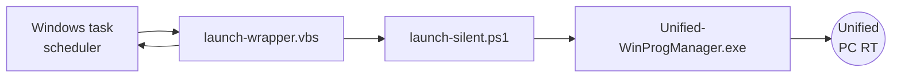
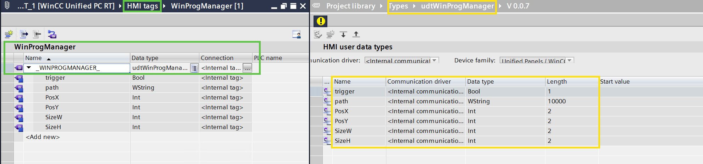

# Unified Windows Program Manager
A small piece of software that runs as a `Windows task (task scheduler)` that executes an OpenPipe script (`Unified-WinProgManager.exe`, that is based on Python OpenPipe examples from DVD2) that subscribe to some variables in the locally running `WinCC Unified PC RT` application. 

## Installation Steps
1. **Download** the file package `UWPM_V1.1.0.zip` from this repository.
2. **Unzip** the files to any location on the WinCC Unified PC RT station.
3. **Run** the `Install_Task_RunAsAdmin.bat` file as **administrator**.

## Uninstallation step
1. **Run** the `Uninstall_Task_RunAsAdmin.bat` file as **administrator**.

## Steps in TIA Portal
1. **Download** the file `/example/Unified-WinProgManager.zal20` from this repository and open it in the **Global libraries** (compressed) area of TIA Portal.

### ***The library*** provided contains:
1. **UDT type**:
   - `udtWinProgManager` that contains the elements for the trigger and the arguments of opening a GUI application:

|          **Tag.Elements**         | **DataType** | **Description** |
|:------------------------|:------------|:-----------|
| `_WINPROGMANAGER_.trigger` | Bool         |  The application looks for this trigger to then read the parameters           |
| `_WINPROGMANAGER_.path`    | WString      | Full path and arguments for the application, can join args with `|` character             |
| `_WINPROGMANAGER_.PosX`    | Int          |  X position (px) to be opened in the screen                |
| `_WINPROGMANAGER_.PosY`    | Int          |  Y position (px) to be opened in the screen                |
| `_WINPROGMANAGER_.SizeW `  | Int          |  Size of the width (px) that the application should have   |
| `_WINPROGMANAGER_.SizeH `  | Int          |  Size of the Height (px) that the application should have  |

2. **Faceplate type**:
	- `fpExampleToPass path` : How to use this example in faceplates. 
3. **Master copies** that contain:
   - Example tag table `WinProgManager` that contains the tag (**with correct tag name**) with data type udtWinProgManager.
   - Example of usage (`ExmapleScreen`).

### ***Engineering*** a project:
1. Simply create an internal tag named:
   - `_WINPROGMANAGER_` of datatype **udtWinProgManager**. This is mandatory! The tag name should be exactly `_WINPROGMANAGER_` as the manager looks for it and all the defined elements (see **UDT Type**).

## Tested scope

This has only be tested with `WinCC Unified PC RT V19 & V20`.

## Please note:
The Windows task re-execute itself each 1 minute for the OpenPipe script to be always connected / executed (otherwise, it loose connection on stopping RT or not finding the right tag to subscribe to). 

You can change the `Windows Task` to trigger on "startup" (delayed) to only run "once", just make sure it starts after the Unified RT is started.

# Disclaimer:

>  The examples are non-committal and do not lay any claim to completeness with regard to configuration and equipment as well as any eventualities. The examples do not represent any custom-designed solutions but shall offer only support at typical tasks. You are accountable for the proper mode of the described products yourself.
> 
>  These examples do not discharge you from the obligation to safe dealing for application, installation, business and maintenance. By use of these examples, you appreciate that Siemens cannot be made liable for possible damages beyond the provisions regarding described above. We reserve us the right to carry out changes at these examples without announcement at any time. The contents of the other documentation have priority at deviations between the suggestions in these examples and other Siemens publications, such as catalogues  and manuals.
>  > Use at your own risk.
